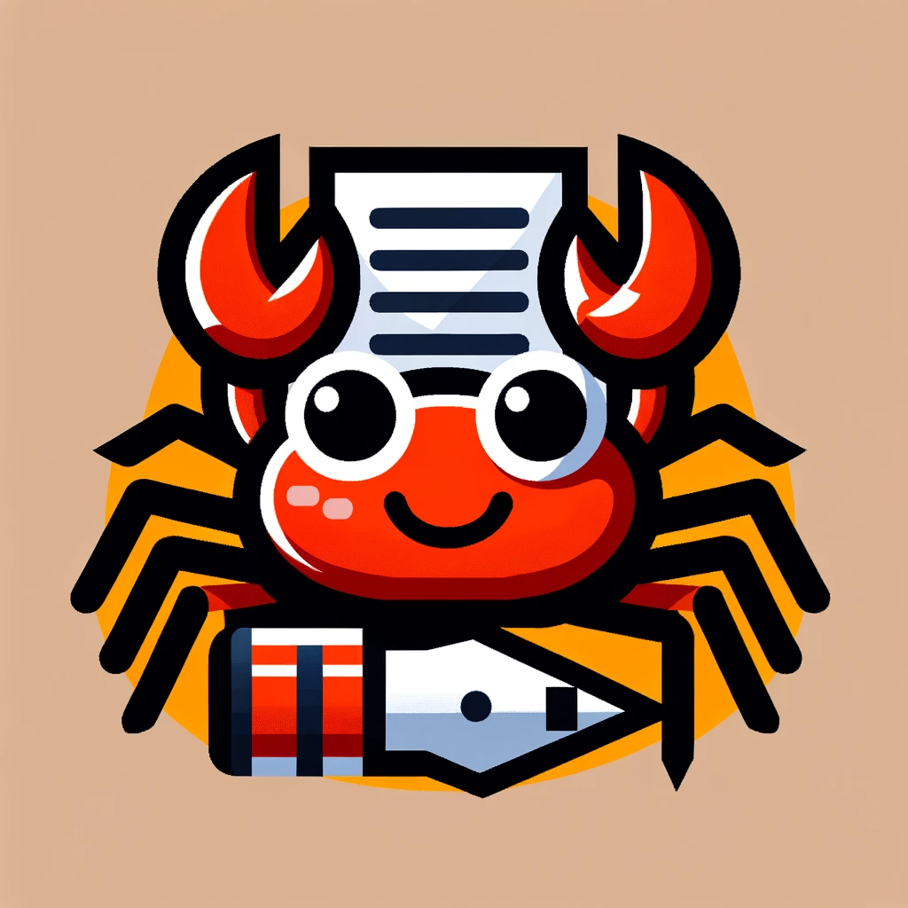

# rust_eton - terminal text editor written in rust

## ✅ What features it has?
- type'ing in letters and quit terminal

## ✈️ What features will it have?
I'd like to have the following:
- type'ing all type of sings
- add emoji support
- remove'ing signs
- save'ing written text in text file
- add some shortcuts and key bindings
- add undo, redo
- create some basic UI
- searching
- syntax highlighting
- markdown support
- latex support
- and more with progress...

